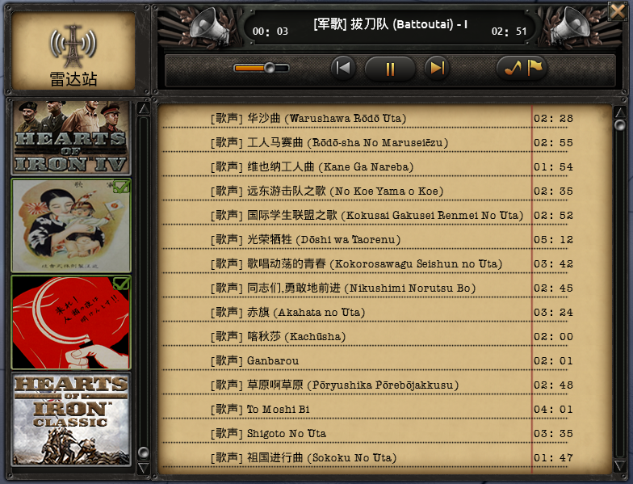

注：这是一个钢铁雄心IV模组的源码的库。

Notice: This repository is for a Mod of `Heart of Iron IV`.

---

# 日本史实音乐及歌声运动音乐

### A Japanese Historical Music & Japanese Communist Music Mod, Forked from "Japanese Historical Music Mod (+Japanese Communist Music)" (On Steam workshop, Not on Github)

Cover from [artworks-33452791:*万国の労働者よ、団結せよ！*](https://www.pixiv.net/artworks/33452791) on Pixel by [赤ぴよ](https://www.pixiv.net/users/2476843)さん.

## 1. 中文

　　此模组是“[Japanese Historical Music Mod (+Japanese Communist Music)](https://steamcommunity.com/sharedfiles/filedetails/?id=699176908)” 这个模组的中文翻译。

　　基于[52](http://bbs.52pcgame.net/)汉化组的[中文翻译](https://steamcommunity.com/workshop/filedetails/?id=698748356)显示。

　　需要先安装上面提到的mod此mod才会生效。

　　由于本人水平有限，许多条目尚未翻译或翻译不准确，若有错误或建议请通过GitHub上推Issue赐教（国区没法回复评论）。GitHub上此物品的库：https://github.com/DrySaltedFish/HOI4-Mod-Japanese_Historical_Music_and_Communist_Music_Mod（就是这里啦）。

## 1. (My poor) English

    Chinese translation of mod "[Japanese Historical Music Mod (+Japanese Communist Music)](https://steamcommunity.com/sharedfiles/filedetails/?id=699176908)"

    Display based on [Chinese translation mod](https://steamcommunity.com/workshop/filedetails/?id=698748356) by [52pcgame.net](http://bbs.52pcgame.net/).

    Need to install previous mentioned mods first.

​    Repository of this project on GitHub: https://github.com/DrySaltedFish/HOI4-Mod-Japanese_Historical_Music_and_Communist_Music_Mod (Of course it's here). Issues can be pulled if any problem found.

## 2. 预览 Preview

## 3. 更新日志 Update Log

[UpdateLog](_readme/UpdateLog.md)